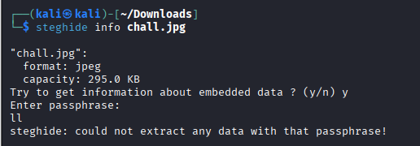
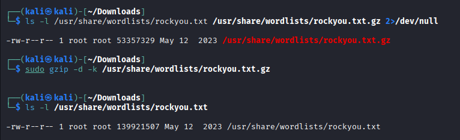
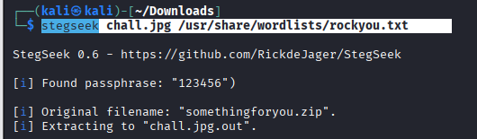
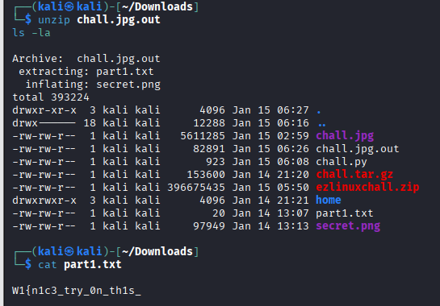
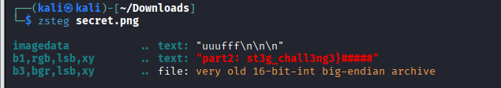

***Try to crack***

***Ý tưởng:***

Flag trong bài này được dấu trong file .jpg nên thử steghide vì đây là dạng kinh điển.

***Bước 1:*** Kiểm tra xem ảnh có embedded data hay không
```css
steghide info chall.jpg

```



Output kiểu:

format: jpeg

capacity: 295.0 KB

Try to get information about embedded data? (y/n)

==> “capacity” xuất hiện là dấu hiệu rất mạnh: steghide nhận diện đây là file có thể chứa dữ liệu giấu 

Nếu file ảnh không ẩn chứa gì bất thường thì thường steghide không có gì đáng kể ngoài format.

Khi mình chọn "y" thì nó hỏi:

Enter passphrase:

==> Đây là dấu hiệu thứ 2: payload bị khóa bằng passphrase.

***Vậy hướng đúng là: crack passphrase để extract.***

***Bước 2:*** Tiến hành tải và giải nén rockyou.txt để bắt đầu tân scoong vét cạn mật khẩu.



***Bước 3:*** Tấn công



===> Lúc này có hai kết luận Passphrase đã đúng và Payload là file zip.

***Bước 4:*** Tiến hành giải nén và tìm FLAG

Giải nén 
```css
unzip chall.jpg.out
```


Ta thấy xuất hiện part1.txt và secret.png vì vậy tiến hành đọc file part1.txt ta tìm được một nửa FLAG
```css
W1{n1c3_try_0n_th1s_
```
PNG là định dạng lossless nên rất hay dùng cho LSB stego → tool phù hợp là zsteg



Ta thấy phần sau của FLAG xuất hiện 
```css
st3g_chall3ng3}
```
FLAG: ***W1{n1c3_try_0n_th1s_st3g_chall3ng3}***