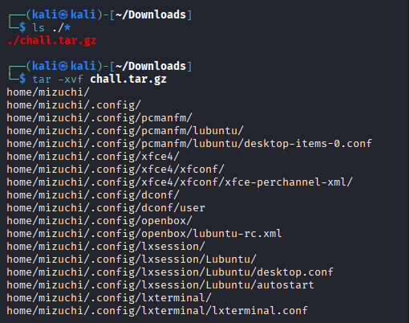
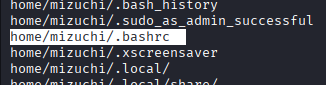
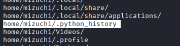
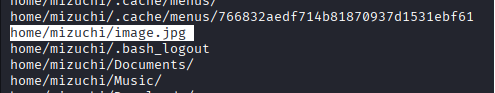
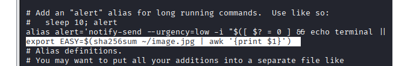
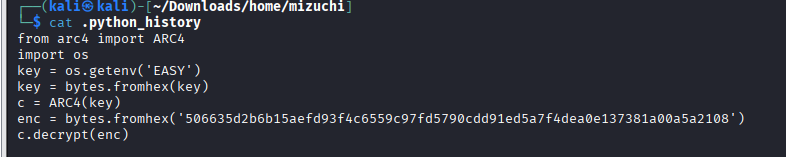
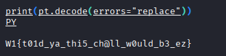

***EZ***

***Mục tiêu:*** Ta cần tìm flag được ẩn trong file chall.tar.gz



***Bước 1:*** Sau khi downloads file chall.tar.gz xuống thì tiến hành ls ./* để xác nhận file đã được tải xuống.

Tiến hành giải nén file:
```css
tar -xvf chall.tar.gz
```
Sau khi giải nén xong thì ta thấy hàng loạt fiel xuất hiện lúc này xuất hiện những file có dấu hiệu đáng ngờ:



Đây là file auto chạy mỗi khi mở terminal/đăng nhập shell vì vậy ta có thể khai thác manh mối ở đây.



Đây là file lịch sử lệnh Python mà trong CTF những file history đều rất quan trọng vì ta có thể truy vết được flag đã được giấu như thế nào.


Đây là file ảnh .jpg cũng rất đáng ngờ vì ta không biết trong ảnh chứa gì, có manh mối nào cho chúng ta khai thác hay không.

***
***Bước 2:*** Tiến hành đọc file .bashrc thì ta phát hiện có dòng đáng ngờ, có dấu hiệu của FLAG.

==> Dòng này cho ta biết biến môi trường EASY = SHA256 của image.jpg (dạng hex) 



***Bước 3:*** Tiến hành đọc file python_history ta thấy được tác giả lấy EASY (sha256 hex) → đổi sang bytes → dùng ARC4 để giải mã chuỗi enc.



***Bước 4:*** Dựa trên những dữ liệu ta khai thác được thì xây dựng thuất toán rc4 để giải mã FLAG:
```css
python3 - <<'PY'
import hashlib

def rc4(key: bytes, data: bytes) -> bytes:
    S = list(range(256))
    j = 0
    for i in range(256):
        j = (j + S[i] + key[i % len(key)]) % 256
        S[i], S[j] = S[j], S[i]
    i = j = 0
    out = bytearray()
    for b in data:
        i = (i + 1) % 256
        j = (j + S[i]) % 256
        S[i], S[j] = S[j], S[i]
        k = S[(S[i] + S[j]) % 256]
        out.append(b ^ k)
    return bytes(out)

img = open("image.jpg", "rb").read()
key = bytes.fromhex(hashlib.sha256(img).hexdigest())

enc = bytes.fromhex("506635d2b6b15aefd93f4c6559c97fd5790cdd91ed5a7f4dea0e137381a00a5a2108")
pt = rc4(key, enc)

print(pt.decode(errors="replace"))
PY
```

===> Ta thu được FLAG


***W1{t01d_ya_thi5_ch@ll_w0uld_b3_ez}***
